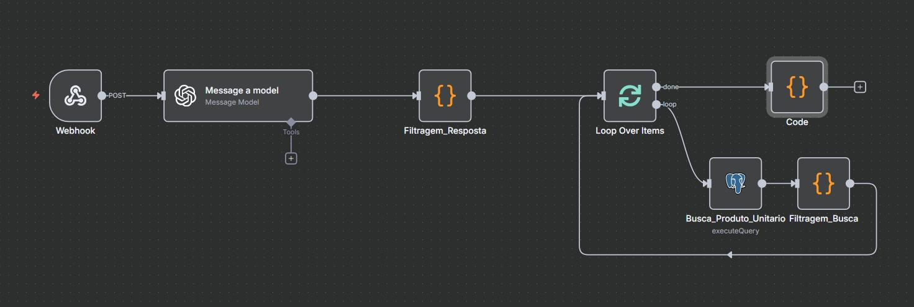
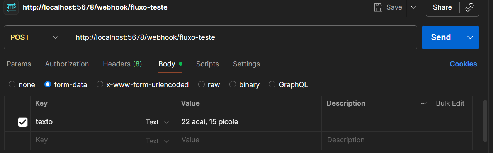

# Consulta de Itens inteligentes

Esse foi um projeto desenvolvido para um processo seletivo da empresa Demander - Força de vendas.

Se trata de um fluxo n8n que filtra a requisição recebida pelo webhook e retorna as buscas dos itens requisitados pelo cliente.

## Tecnologias Utilizadas

- N8N;
- OpenAI API;
- Javascript;
- PostgreSQL;
- Docker;

## Arquitetura N8N



- Webhook recebe uma requisição POST com body form-data e key texto:



- Esse texto é filtrado por algum modelo de IA, nesse caso o GPT 4o para retornar um JSON desse tipo:

```json
    {
    "qtde": 22,
    "termo_pesquisado": "acai"
    },
    {
    "qtde": 15,
    "termo_pesquisado": "picole"
    }
```

- Em seguida o Node "Filtragem_Resposta retorna esse JSON para o Loop Over Items"

- O Node Loop Over Items gera um Loop para cada objeto retornado pela IA

- O Node Busca_Produto_Unitario realiza uma busca pelo termo_pesquisado de cada objeto

- O Node Filtragem_Busca formata a saída da busca para que seja possível identificar qual busca é referente à qual objeto

- Ao sair do Loop, o Node Code realiza a formatação final do JSON de retorno do Webhook, o retorno será parecido com esse:

```json
{
    "possiveis_produtos": [
        {
            "termo_pesquisado": "acai",
            "qtde": 22,
            "produtos_encontrados": [
                {
                    "codigo": "82",
                    "descricao": "AÇAI ESPECIAL - 534"
                }
            ]
        },
        {
            "termo_pesquisado": "picole",
            "qtde": 15,
            "produtos_encontrados": [
                {
                    "codigo": "42145",
                    "descricao": "CARRINHO DE PICOLES C-403 P "
                }
            ]
        }
    ]
}
```

# Como fazer o Deploy

<h3>Pré-requisitos</h3>

- Docker;
- Git.

<h3>Passo a passo</h3>

- Clone esse repositório;

- Configure seu .env utilizando o .envExample como base;

- Utilize o comando abaixo para fazer o build do Docker Compose:

<code>docker-compose up --build</code>

- Acesse seu n8n no link:

<code>http://localhost:5678/</code>

- Exporte o fluxo presente na pasta n8n para seu ambiente N8N;

- Configure as credenciais do postgres com base em seu .env;

- Configure sua API Key da Open AI no Node Message a Model;

- Pronto, agora basta ativar o workflow para produção.

# Dificuldades Encontradas

Esse foi meu primeiro projeto com N8N, portanto tive de estudar bastante as melhores práticas e estou bem confiante no resultado final.

As minhas principais dificuldades foram:

- Aprender a usar n8n;
- Configurar as credenciais Postgres pois estava em um ambiente Docker;
- Fazer migração dos dados do JSON para um banco de dados PostgreSQL;
- Fazer o último código para formatação do JSON de resposta.